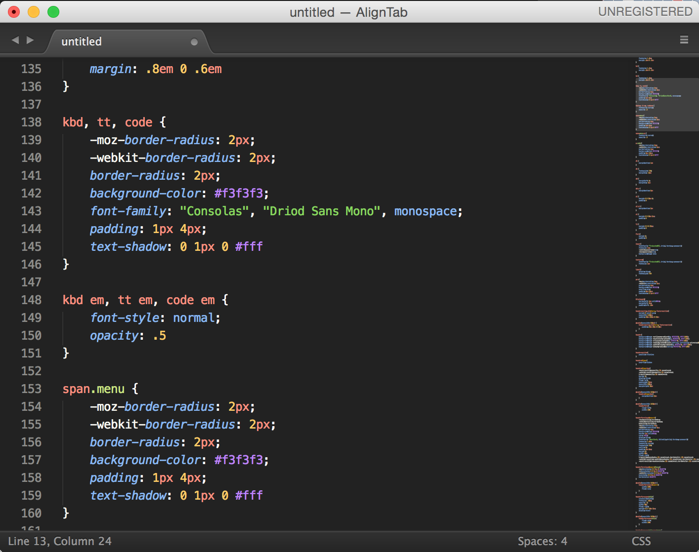
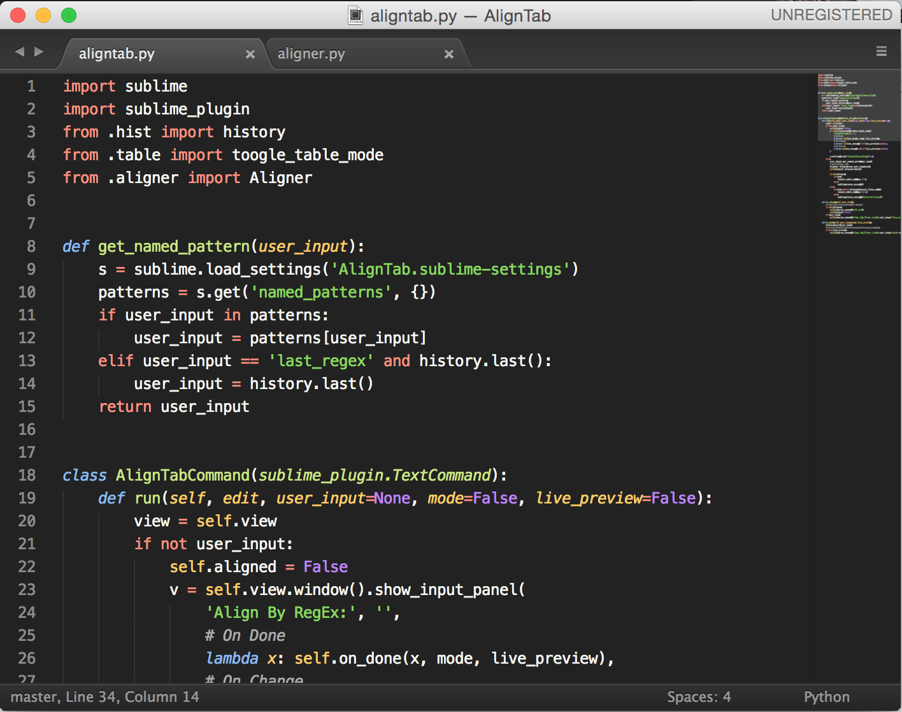
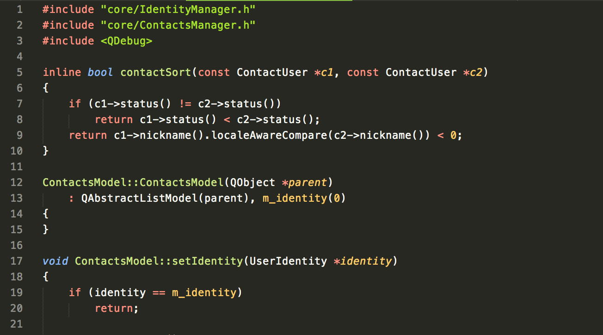
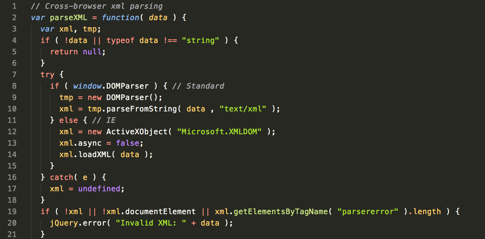

This is derived from [sublime-monokai-extended](https://github.com/jonschlinkert/sublime-monokai-extended).
The color scheme is from [Wombat](http://dengmao.wordpress.com/2007/01/22/vim-color-scheme-wombat/).

CSS

Python

C++

Javascript

More screenshorts [here](http://colorsublime.com/theme/Wombat).